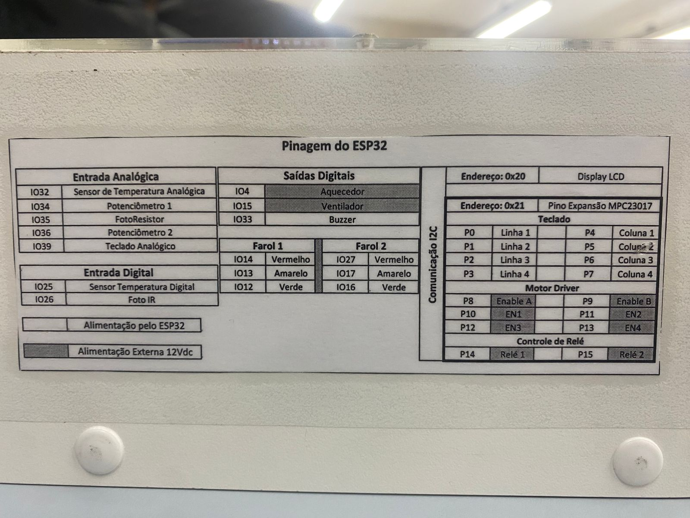

# Firmware para Máquina de Lavar Doméstica com ESP32
### Grupo 2 — Eficiência Energética

Projeto da disciplina de Microcontroladores (Engenharia de Computação — Centro Universitário Fundação Santo André), avaliação P2 2026, baseada na Taxonomia de Bloom.

**Integrantes:** Gabriel Ávila de Oliveira, Nicholas Vincent Perin, Vitor Borges Souza
**Orientador:** Prof. Edson Antônio De Abreu

---

## Visão geral

Firmware que simula o controle de uma máquina de lavar roupas em um ESP32, implementando a máquina de estados completa do ciclo (enchimento → lavagem → escoamento → enxágue → escoamento → centrifugação → fim), com temporização feita inteiramente via hardware timers (sem uso de `delay()`/`millis()`).

A especialização do grupo é a **eficiência energética**: o duty cycle do motor não é fixo — ele é calculado dinamicamente a partir do nível de água lido no enchimento (valor "congelado" para o resto do ciclo), estimando potência, corrente, eficiência (%) e energia total consumida (Wh) em tempo real.

## Funcionalidades

- **Máquina de estados** com 9 estados (`IDLE`, `ENCHIMENTO`, `LAVAGEM`, `ESCOAMENTO_1`, `ENXAGUE`, `ESCOAMENTO_2`, `CENTRIFUGACAO`, `FIM`, `ERRO`)
- **3 hardware timers do ESP32**:
  - `timerMS` — substitui `millis()`/`delay()` (base 1 MHz, 1 ms/tick)
  - `timerCiclo` — controla a duração de cada etapa (base 1 MHz, 1 s/tick)
  - `timerPWM` — gera o PWM do motor via software (base 100 kHz, ciclo de 10 ms / 100 Hz)
- **Entrada de dados**: teclado matricial 4×4 via expansor I²C MCP23017 (endereço `0x21`) e potenciômetro no ADC (nível de água simulado)
- **Saída**: display LCD 16×2 via I²C (`0x20`), faróis de LED (indicação visual da etapa) e buzzer
- **Bluetooth Serial** (`BluetoothSerial.h`) para monitoramento e comando remoto — o teclado físico tem prioridade; o Bluetooth só é lido quando nenhuma tecla é pressionada
- **Cálculo de eficiência energética**:
  - Duty cycle: `D_lavagem = 30 + 0,7·N`, `D_enxágue = 20 + 0,4·N`, `D_centrifugação = 95%` (fixo), onde `N` é o nível de água normalizado
  - Potência: `P = 500 × d²` (W)
  - Corrente: `I = P / 220` (A)
  - Eficiência: `η = 100 − (d × 100 × (1 − n))` (%)
  - Energia acumulada em Wh, integrada a cada iteração do loop
- **Simulação de falha de segurança**: tecla que alterna estado de "porta aberta", interrompendo o ciclo se acionada durante a lavagem

## Hardware utilizado

| Periférico                         | Conexão                               |
| ---------------------------------- | ------------------------------------- |
| ESP32                              | Módulo padrão fornecido pela FSA      |
| Display LCD 16×2                   | I²C, endereço `0x20`                  |
| Expansor MCP23017 (teclado 4×4)    | I²C, endereço `0x21`                  |
| Potenciômetro (nível de água)      | ADC — IO36                            |
| Faróis de LED (indicação de etapa) | IOs digitais (14, 13, 12, 27, 17, 16) |
| Buzzer                             | IO33 (PWM via `ledc`)                 |
| Motor (simulado)                   | Saídas digitais via MCP23017          |



## Estrutura do repositório

```
├── firmware/           # Código-fonte C++ (.ino)
├── relatorio/           # Relatório técnico em PDF
├── avaliacao/            # Documento de avaliação da disciplina (enunciado)
└── README.md
```

## Limitações conhecidas

- **Simulação, não hardware real de lavagem**: água, motor de indução e sensores de nível reais são simulados por potenciômetro, LEDs e cálculos — não há atuação física real sobre carga d'água ou tecido.
- **PWM por software**: o duty cycle do motor é gerado via ISR de timer (não usa os periféricos LEDC nativos do ESP32 para o motor), o que é funcional mas menos preciso e mais custoso em CPU do que um PWM de hardware dedicado.
- **Modelo de potência simplificado**: a relação `P = 500 × d²` é uma aproximação didática de carga controlada por PWM, não uma medição real de um motor físico.
- **`esperarMS()` ainda é bloqueante**: embora substitua `delay()`, a função de espera baseada no timer de milissegundos ainda bloqueia o loop principal durante bipes do buzzer e transições de etapa — não é uma solução 100% não-bloqueante.
- **Debounce do teclado por software**: implementado com janela fixa de 150 ms: pode gerar leituras perdidas em pressões muito rápidas.
- **Bluetooth Serial simples**: comandos são caracteres únicos sem autenticação ou validação de protocolo; qualquer dispositivo pareado pode enviar comandos.
- **Sem persistência de estado**: uma queda de energia durante o ciclo reinicia tudo do zero (não há uso de NVS/RTC para retomar o ciclo).
- **Tempos de ciclo reduzidos**: as durações das etapas (10–15 s) são valores de demonstração para bancada, não tempos reais de uma lavagem doméstica.

## Conclusão

O projeto cumpriu os requisitos mínimos (máquina de estados, sensoriamento, atuadores, temporização por timers e Bluetooth) e a especialização de eficiência energética proposta ao grupo. A maior dificuldade foi substituir `delay()`/`millis()` por temporização via registradores de hardware timer, o que aumentou significativamente a complexidade e o volume de código em relação a uma implementação ingênua, mas resultou em um sistema mais responsivo e adequado às boas práticas de sistemas embarcados. A integração do teclado externo via MCP23017 também exigiu abandonar o uso exclusivo de bibliotecas nativas do Arduino em favor de `LiquidCrystal_I2C.h`, para manter a estabilidade do código. No fim, o firmware roda de forma estável na bancada, exibindo em tempo real potência, eficiência e consumo energético estimado do ciclo de lavagem.

## GitHub dos colaboradores:

[Gabriel Ávila de Oliveira]() | 
[Nicholas Vincent Perin](https://github.com/NicholasPerin) | 
[Vitor Borges Souza](https://github.com/VitorAdmita)

## Referências

- MAKIYAMA, M. *Entenda o que é PWM, para que serve, como funciona e suas aplicações*. VictorVision, 2025.
- PEDRO. *O que é PWM (Pulse-Width Modulation)? Funcionamento e aplicações*. Clube do Maker, 2026.
- SOUZA, F. *PWM de Arduino*. Embarcados, 2014.
